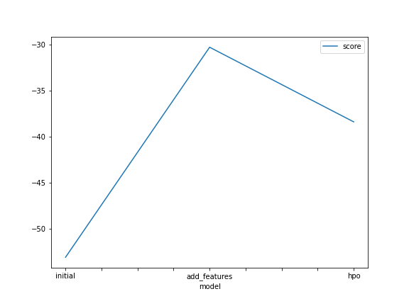
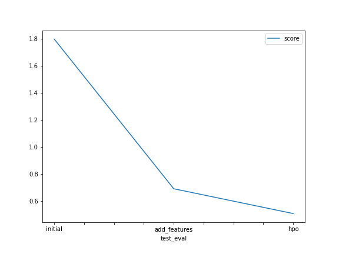

# Report: Predict Bike Sharing Demand with AutoGluon Solution
#### Tesfaye Alemayehu

## Initial Training
### What did you realize when you tried to submit your predictions? What changes were needed to the output of the predictor to submit your results?

At first I had found out really bad results based on my dataset without feature engineering but after adding a few new columns (performing feature engineering) and data cleaning i got a better result. With the usage of hypermeter i got a better score as well. On sublittion i found out that my submittion results did not had negative values so that it was ok.

### What was the top ranked model that performed?
On training run the WeightedEnsemble_L3 model was a better performant but on kaggle score with hypermeters tuning RandomForest_BAG_L1 was a better model

## Exploratory data analysis and feature creation
### What did the exploratory analysis find and how did you add additional features?
I have added extra features mainly from the datetime object by creating date,month,hour for the datasets. And I was able to change the datatypes of season and weather into catagorical inorder to help the model to better use the columns.

### How much better did your model preform after adding additional features and why do you think that is?
It improved the performance drastically Because the more data the mdels has been fed the better pattern they could draw from those new features. According to kaggle score it has improved by 61.6 percent.

## Hyper parameter tuning
### How much better did your model preform after trying different hyper parameters?
After trying out some hypermeter i was able to get not better score on training dataset but according to kaggle score it has improved by 26.59 percent.

### If you were given more time with this dataset, where do you think you would spend more time?
I would spend most of my time improving the quality of the data (cleansing and feature engineering) and hypertuning the models for better performance

### Create a table with the models you ran, the hyperparameters modified, and the kaggle score.
|model|hpo1|hpo2|hpo3|score|
|--|--|--|--|--|
|initial|default|eval_metric="root_mean_squared_error",presets="best_quality",time_limit=600|default|1.79525|
|add_features|default|eval_metric="root_mean_squared_error",presets="best_quality",time_limit=600|default|0.68923|
|hpo|default|eval_metric="root_mean_squared_error",presets="best_quality",time_limit=600|GBM:"num_boost_round:100,num_leaves:26-66",NN:"num_epochs:50,dropout_prob:0.0,0.5"|0.50594|

### Create a line plot showing the top model score for the three (or more) training runs during the project.

### Create a line plot showing the top kaggle score for the three (or more) prediction submissions during the project.

## Summary
On this project i was able to work on aws sagemaker and autogluon. I have been able to see the power of EDA , data cleansing and feature engineering before approching model creation and tuning. I was able  
